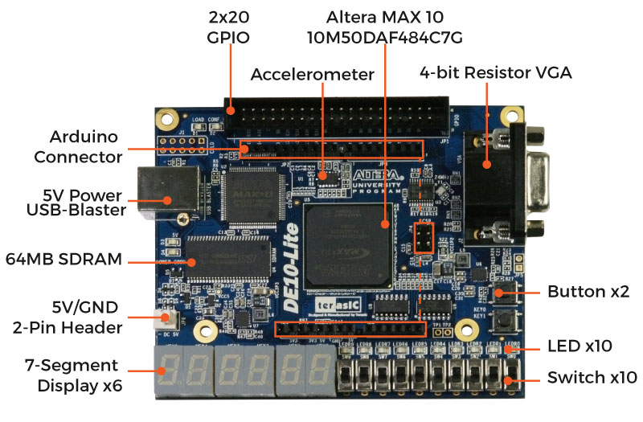

# DE10-Lite FPGA Projects

Welcome to my FPGA project collection using the [DE10-Lite development board](https://www.terasic.com.tw/cgi-bin/page/archive.pl?CategoryNo=234&Language=English&No=1021). This repository serves as both a personal learning journey and a showcase of practical applications using Verilog and the Quartus development environment.

## 📘 About This Repository

This project archive focuses on learning and demonstrating the capabilities of Field-Programmable Gate Arrays (FPGAs) using the DE10-Lite, a cost-effective board based on the Intel MAX 10 FPGA. All designs are coded in **Verilog**, a hardware description language used to model digital systems.

The goals of this repository are to:
- Practice digital design fundamentals and FPGA workflows.
- Understand how to configure and use FPGA hardware (via switches, LEDs, clocks, etc.).
- Build a library of example projects showcasing real-world applications.
- Document and reinforce core FPGA concepts such as sequential logic, state machines, timing, and synthesis.

## 🔧 Tools Used

- **Board**: Terasic DE10-Lite (Intel MAX 10 FPGA)
- **Language**: Verilog HDL
- **IDE**: Quartus Prime Lite Edition
- **Programmer**: USB-Blaster

## 🧠 What You'll Learn

By exploring these projects, you can gain experience with:
- FPGA toolchain (synthesis, fitting, timing analysis, programming)
- Using Verilog for RTL (Register-Transfer Level) design
- Pin mapping and constraint files (`.qsf`)
- Utilizing switches, LEDs, and clocks on the DE10-Lite board
- Designing combinational and sequential logic circuits
- Modularity and reuse of code blocks

## 📎 Getting Started

To try out a project:
1. Open Quartus Prime Lite Edition.
2. Navigate to a `project/` folder (e.g., `projects/blinking_led`).
3. Open the `.qpf` file to launch the project.
4. Assign FPGA pins via `Assignments > Pin Planner` if needed.
5. Compile and program the board using the USB-Blaster.

## 📚 Further Resources

- [Nandland FPGA tutorials](https://www.nandland.com/)
- [Terasic DE10-Lite Product Page](https://www.terasic.com.tw/cgi-bin/page/archive.pl?CategoryNo=234&Language=English&No=1021)
- [Terasic DE10-Lite User Manual (PDF)](https://ftp.intel.com/Public/Pub/fpgaup/pub/Intel_Material/Boards/DE10-Lite/DE10_Lite_User_Manual.pdf)

---

Stay tuned as I continue adding new designs and documenting more advanced concepts.
